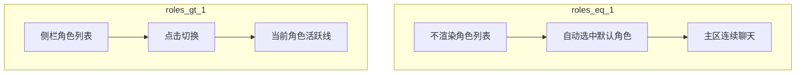

# 多角色产品设计（ADR 配套）

> 权威决策见 [ADR 2026-09-09](adr/2026-09-09-multi-role-shell.md)。本文展开产品/界面/分期，供实现对照。

## 1. 产品模型

| 维度 | 约定 |
|------|------|
| 角色 | 可多个；字段：名称、头像、系统提示词、定时任务（定时后续） |
| 默认 | 启动仅一个「通用」默认角色（`id=default`） |
| 知识库 | **全角色共享**读写 |
| 记忆 | **全局抽取**覆盖所有角色会话；规则仍为关于主人 / 耐久性 / 语境保全 |
| 并行 | 角色独立上下文与 turn；切换 UI **不取消**其他角色 running turn |
| 生长 | 用户可创建新角色（设置 / 后续对话工具）；不强制安装向导 |

心法/戒律 = 全局底线；角色 `system_prompt` = 叠加层。

## 2. 界面 IA（对话列表 → 角色列表）

主导航只回答「哪个角色」；「哪次聊天」交给活跃线 + 搜索 + 次级历史。

| 能力 | 位置 |
|------|------|
| 当前在聊 | 选中角色 → 该角色**活跃线** |
| 连续窗口 | `continuity_idle_hours`（默认 6h，与记忆 24h idle 分离） |
| 新话题 | 文案「新话题」；当前 `role_id` 下新建 conversation |
| 旧内容 | 会话搜索 +「接着上次」；本角色历史为**次级**入口 |
| KB | 侧栏下半不变 |

**不采用：** 设置里简单/高级总开关；单角色时仍画一项角色列表。

## 3. 数据与 API（实现清单）

### 3.1 存储

- `{kb}/.kb/roles/roles.db` → `roles` 表  
  - `id, name, avatar, system_prompt, is_default, sort_order, created_at, updated_at`
- `conversations.role_id`（缺列 `ALTER` + 默认 `default`；旧会话回填）
- 配置：`Settings.continuity_idle_hours: float = 6.0`

### 3.2 活跃线算法

对给定 `role_id`：

1. 优先复用该角色下 `message_count == 0` 的会话；
2. 否则取该角色 `updated_at` 最新会话：若 `last_user_message_at`（无则 `updated_at`）在连续窗口内 → 用之；
3. 否则创建新会话并返回。

### 3.3 HTTP（建议）

| 方法 | 路径 | 说明 |
|------|------|------|
| GET | `/api/roles` | 列表（启动确保默认角色） |
| POST | `/api/roles` | 创建 `{name, system_prompt?, avatar?}` |
| GET/PATCH/DELETE | `/api/roles/{id}` | 读/改；默认角色不可删 |
| POST | `/api/roles/{id}/ensure-active` | 解析/创建活跃线 → `{conversation_id}` |
| GET | `/api/roles/busy` | 有 running turn 的 `role_ids` |
| GET/POST | `/api/roles/{id}/schedules` | 角色定时列表 / 创建 |
| PATCH/DELETE | `/api/roles/{id}/schedules/{sid}` | 改启停与间隔 / 删除 |
| POST | `/api/conversations` | body 可选 `{role_id}`；缺省绑默认角色 |
| GET | `/api/conversations?role_id=` | 可选按角色过滤（次级历史用） |

### 3.4 Agent 注入

顺序：心法戒律 →（可选）角色 system_prompt 块 → 内置 SYSTEM_PROMPT → user_memory → …

在 `TurnExecutionHub` / `AgentOrchestrator.run` 按 `conversation.role_id` 查 `RoleStore`。

## 4. 前端挂点

| 模块 | 改动 |
|------|------|
| [`Sidebar.tsx`](../frontend/src/components/Sidebar.tsx) | `roles.length > 1` 才渲染角色列表；否则隐藏；「新建」→「新话题」；设置/历史/忙碌角标 |
| [`useConversationShell.ts`](../frontend/src/hooks/app/useConversationShell.ts) | `activeRoleId`；启动 `ensure-active`；`localStorage` 记上次角色；角色设置/历史抽屉 |
| [`RoleSettingsModal.tsx`](../frontend/src/components/RoleSettingsModal.tsx) | 人设/头像/改名/定时 |
| [`RoleHistoryDrawer.tsx`](../frontend/src/components/RoleHistoryDrawer.tsx) | 本角色会话历史次级入口 |
| [`MobileChatHeader.tsx`](../frontend/src/components/app/MobileChatHeader.tsx) | ≥2 角色：标题=角色名，可 sheet 切换 |
| [`api.ts`](../frontend/src/api.ts) / types | Role 类型与上述 API |

首期可不做：定时任务 UI、对话 `create_role` 工具、忙碌角标、历史抽屉（可先用 `?role_id=` 列表）。

## 5. 分期

1. **P0** — RoleStore + `role_id` + API + 默认角色；创建/列表会话带角色；prompt 注入；侧栏单/多角色切换与活跃线。
2. **P1** — 连续窗口精细化、用户侧会话搜索、新话题文案与空态引导。（含设置页连续窗口、手机角色 sheet、提示词「接着上次」强化）
3. **P2** — 角色设置页（人设/头像）、定时任务、对话创建角色、忙碌角标、本角色历史抽屉。

## 6. 验收

### P0

- 新安装打开：无角色列表，可直接聊，会话挂在默认角色。
- 创建第二角色后：侧栏出现角色列表；切换换活跃线；后台另一角色 turn 不被 cancel。
- KB / 记忆仍全局；角色提示词进入 system（有角色文案时）。
- 旧库升级：已有会话 `role_id=default`，出现默认角色行。

### P1

- 设置 → Agent 可改连续窗口小时数；`ensure-active` 使用该值。
- 侧栏可搜索历史对话，点选跳转会话（及消息）。
- 空态有简短引导（直接说 / 搜索 / 接着上次 / 建角色）。
- ≥2 角色时手机顶栏可切换角色。
- 用户说「接着上次 / 我们说过」时，system 要求先搜会话再答。

### P2

- 角色设置：可改名称、头像 URL、人设；非默认角色可删（会话迁回默认）。
- 角色级定时：设置页可增删启停；到期写入该角色活跃线；有 running turn 时顺延。
- Agent 工具 `create_role`：对话中可创建角色，侧栏随后可见。
- ≥2 角色时侧栏头像有忙碌角标（该角色有 running turn）。
- ≥2 角色时「历史」打开本角色会话抽屉。
