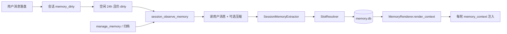

# 记忆抽取重设计：抽象 Slot + 会话级定稿

日期：2026-08-07  
状态：设计已确认；Phase 1 核心与 Phase 2 轻量面板 API/设置页已落地（迁移 LLM 可选 `--use-llm`）  
前置文档：[第二大脑记忆系统](./2026-07-13-memory-layer-design.md)

本文件修正记忆**自动抽取与合并**路径；情景召回、tombstone、敏感分级、衰减天数等与前置文档一致的部分仍然有效。冲突时以本文件为准。

**投影修订（相对前置文档）：** 取消持久化 `系统/记忆.md` 双写。`memory.db` 为唯一权威源；每轮由 `MemoryService.render_context()` 从 confirmed 直出容量裁剪文本注入。编辑入口为设置页记忆面板与 `manage_memory`；知识库写入该路径须拒绝。

## 0. 提示词开发规范（见仓库根目录 `AGENTS.md`）

记忆抽取相关 prompt 的编写须遵循 `AGENTS.md`：只记**关于主人**的稳定画像；写原则不写个案黑名单；判定口诀为「删掉该句后主人画像是否变少」。

## 1. 问题

现网把 `slot_key` 实现成「category + statement 全文 stem」，导致：

- 近义偏好（如两条「数据可视化替代插图」）落成**两个 slot、两条 confirmed**；
- `_resolve_slot_conflicts` / upsert 幂等从未触发；
- 设计文档中的抽象槽位、受控谓词、同槽替代全部空转。

同时，**按条用户消息**异步 `observe_memory` 过密，中途摇摆也会落库。

## 2. 目标

1. 恢复 **slot / value 分离**：身份是抽象槽，不是整句文本。
2. **会话定稿后**再抽取，以终局立场为准；支持隔天续聊后重抽。
3. 同槽近义 **merge**，真冲突 **replace**；抽取时可见已有画像以防开槽漂移。
4. 投影与 prompt **干净**：无来源、注入剥离 marker。
5. 保留 **inferred → candidate → 跨会话晋升**；candidate 不进投影。
6. 本期交付抽取核心 + 一次性迁移；**轻量记忆面板为 Phase 2**。

## 3. 已确认决策

| # | 决策 |
|---|---|
| 1 | 身份 = 抽象 `slot_key` |
| 2 | 半开放谓词：种子表 + 可提出新谓词 |
| 3 | 抽取 prompt 含：种子表 + 已确认 `slot → statement` |
| 4 | 同槽 canonical merge；真冲突 replace/supersede |
| 5 | 新槽在 `direct` 下可直接 confirmed；不为「新谓词」另设 candidate 门槛 |
| 6 | 合并只在抽取时；不做事后跨槽维护 job |
| 7 | observe / `manage_memory` / 面板编辑 共用 SlotResolver；不再经 `记忆.md` 手改回灌 |
| 8 | 观察单元 = 整段会话（非每条消息） |
| 9 | 自动触发 = 该会话**最后一条消息**后空闲且 `dirty`；纯浏览/切换会话不触发 |
| 10 | 空闲默认 **24h**（可配） |
| 11 | 输入以**用户消息**为主；过长则先压成自述时间线再抽 |
| 12 | 重抽 = 全量再推导 + 与**全局**画像 merge/replace；本次未提及不删除旧槽 |
| 13 | 上线一次性迁移合并近义旧条（可审计日志） |
| 14 | 种子 = 手写核心 + 迁移中升格稳定新槽 |
| 15 | 出处仅 `conversation_id`（+ 时间）；注入零来源 |
| 16 | 注入剥离 `<!-- memory:… -->`；不再落盘投影文件 |
| 17 | 废除按条 `observe_memory` outbox |
| 18 | 保留 inferred：同表 `status=candidate`；`distinct(conversation_id) ≥ 2` 且置信度 ≥ 0.80 晋升；不进投影 |
| 19 | Phase 2：轻量记忆面板（列表 confirmed+candidate；确认/拒绝/编辑/遗忘；跳转来源会话） |

显式「记住」与归档触发的抽取：**立即**走 Resolver，不依赖 24h。

## 4. 架构（相对前置文档的变更）



三层记忆含义不变。变更点：

- Job 粒度从 **message** 改为 **conversation**。
- Extractor 输入从单条消息改为会话用户消息集（+ 全局已确认摘要 + 种子谓词）。
- Evidence 从字级 span 降为 **会话级** `conversation_id`（解释时打开该会话，不在注入中展示）。
- **无**持久化 `系统/记忆.md`；启动时清理遗留投影文件。

## 5. Slot 模型

### 5.1 形态

```text
slot_key = "{category}.{predicate}"
例: preference.illustration_style
    preference.response_language
    identity.occupation
    workflow.script_layout
    constraint.no_ai_images
```

禁止再使用 statement 全文 stem 作为 slot。

### 5.2 种子表

- 配置或代码内维护核心谓词（约 15–30 个）及别名（中英/同义触发词）。
- 迁移与运行中稳定出现的新谓词可**升格**进种子表（人工或半自动 PR/配置更新）。
- Policy 对 slot 做确定性归一化：小写、分隔符、别名映射。

### 5.3 抽取输出（概念 schema）

```json
{
  "items": [
    {
      "slot_key": "preference.illustration_style",
      "action": "merge | replace | noop | new",
      "statement": "我偏好用数据可视化（榜单/词云/分布图）替代插图，不使用 AI 生成图。",
      "category": "preference",
      "origin": "direct | inferred",
      "confidence": 0.9
    }
  ]
}
```

- 优先复用已有/种子 slot；`new` 应克制。
- `merge`：综合新旧为更完整 canonical statement。
- `replace`：真冲突或带「改为/不再/以后」等变化信号。
- `noop`：同义复述且无需改句（可只追加会话出处、刷新 last_seen）。

### 5.4 写入路径统一

| 入口 | 行为 |
|---|---|
| 会话空闲抽取 | SessionExtractor → Resolver |
| `manage_memory` | 单条 statement → 同一 Resolver（下一轮注入立即可见） |
| 设置页记忆面板 | confirm / reject / edit / forget → Store（不经文件） |

## 6. 触发与生命周期

### 6.1 Dirty

- 会话新增**用户**消息 → `memory_dirty = true`，记录/更新 `last_user_message_at`。
- 成功完成一次会话抽取且无更新失败 → `memory_dirty = false`，记录 `last_memory_extract_at` 与 revision。

### 6.2 调度

- 后台扫描：`dirty AND now - last_user_message_at >= memory_session_idle_hours`（默认 24）。
- **不**因侧栏切换、打开历史会话、只读浏览而入队。
- 用户在该会话继续发言 → 重新 dirty；下次空闲后**整段重抽**。

### 6.3 重抽语义

- 输入：本会话全部用户消息（过长则压缩）+ 全局已确认 slot→statement + 种子表。
- 输出动作作用于**全局** memory.db。
- **不**因「本轮 items 未包含某槽」而删除或遗忘该槽。
- 改口依赖模型输出 `replace`（或变化信号）。

### 6.4 废除按条观察

- 停止为每条用户消息入队 `observe_memory`。
- 新 kind：`session_observe_memory`（或等价命名），`source` 为 `conversation_id`。
- 升级时取消/忽略未完成的按条 observe job。

## 7. Candidate（inferred）

### 7.1 存储

- 仍在 `memory_facts`，`status='candidate'`，`origin='inferred'`。
- **不**进入 `memory_context()` / `recall_memory` 默认结果。

### 7.2 出处

- `memory_evidence` 简化为会话级：至少 `fact_id + conversation_id + observed_at`。
- 同一 candidate 在同一会话重复抽取：更新 last_seen，不重复计会话数。
- 字级 `message_id/start/end` 不再作为晋升或注入所需；实现可废弃或保留空列兼容。

### 7.3 晋升

```text
status == candidate
AND origin == inferred
AND distinct(conversation_id) >= 2
AND confidence >= 0.80
→ confirmed（下一轮注入可见）
```

对外文案：**至少两个不同会话出现一致推断**。

捷径：同槽出现 `direct` / `manual` / `explicit_remember` → 直接 confirmed，旧 candidate `superseded`。

### 7.4 衰减

沿用前置文档：candidate 长期无新证据 → `rejected`（maintenance）。

## 8. 注入（DB 直出）

- `MemoryService.render_context()`：`list_confirmed()` → `MemoryRenderer.render(max_chars)` → 剥离 marker 与空 section。
- `SystemLayer.memory_context()` 仅调用上述方法，**不读不写**知识库文件。
- 禁止在注入中写入 conversation_id、confidence、status、slot_key（slot 仅存 db）。
- 对 `系统/记忆.md` 的 KB API / `write_kb` / `edit_doc` 硬拒，提示改用设置 → 记忆或 `manage_memory`。

## 9. 迁移

上线任务（一次性，可重复 dry-run）：

1. 列出全部 `confirmed`（及可选 candidate）。
2. 用 SlotResolver/迁移专用 LLM 调用：分配抽象 slot、合并近义、产出 canonical statement。
3. 写回 memory.db（supersede 被合并项），打审计日志。
4. （可选）打印 `render_context()` 预览；不再写 `记忆.md`。
5. 将稳定新谓词候选列表输出，供升格种子表。

验收金样例：原「数据可视化」两条 → **同一** `preference.illustration_style`（或等价种子名）一条 confirmed。

## 10. Phase 2：轻量记忆面板

不在本期必达，但接口应预留：

- 列表：confirmed + candidate（含 slot、statement、origin、来源 conversation_ids）。
- 操作：确认晋升、拒绝、编辑 statement、遗忘（tombstone）。
- 跳转：打开来源会话（会话级出处即可）。

candidate 按规则自动晋升/衰减；confirmed 通过设置页记忆面板与 `manage_memory` 修改。

## 11. 非目标（本期）

- 事后跨槽定期合并 job。
- 字级 evidence 高亮（可日后升级）。
- 完整运维式记忆控制台（种子编辑器、抽取日志浏览器等）。
- 按条消息实时画像（已明确放弃）。

## 12. 对前置文档的显式修订

| 前置条款 | 本设计 |
|---|---|
| 按消息 observe + 字级 evidence | 会话级 observe + conversation_id 出处 |
| Extractor 仅从受控表选或提出新谓词 | 保留；并**必须**看见已有画像 |
| 同槽冲突规则 | 保留；补齐 canonical **merge** 动作 |
| 自动学习 30s SLA | 改为会话空闲后最终一致（默认 24h）；显式 manage 仍 read-your-writes |
| 测试「同 slot 同义改写命中 tombstone」 | 在抽象 slot 下仍然成立，且成为主路径 |

## 13. 建议实现切分（实施计划另文）

1. **Slot 基础**：`normalize_slot_key` 改为抽象谓词；种子表；Store/Resolver API。
2. **SessionExtractor**：prompt、压缩、action schema；废除按条 observe。
3. **Dirty/调度**：会话字段 + idle scanner；显式路径即时抽取。
4. **Evidence 会话级 + candidate 晋升**按 `distinct(conversation_id)`。
5. **注入剥离 marker**。
6. **一次性迁移** + 金样例验收。
7. **Phase 2** 记忆面板 API + UI。

## 14. 验收场景

1. 两段不同措辞的「数据可视化替代插图」direct → 迁移或新抽后仅一条 confirmed、同一 slot。
2. 同会话中途改口、24h 后抽取 → 以终局 `replace/merge` 为准。
3. 隔天续聊 → dirty → 再空闲后重抽，全局槽正确更新且未聊到的槽仍在。
4. 仅切换浏览其他会话 → 不入队抽取。
5. inferred 单会话 → 仅 candidate；第二会话一致 → confirmed 并出现在下一轮 `memory_context()`。
6. `memory_context()` 不含 `<!-- memory:` 与 conversation_id。
7. `manage_memory` 后下一轮注入立即可见，且知识库无 `系统/记忆.md`。
